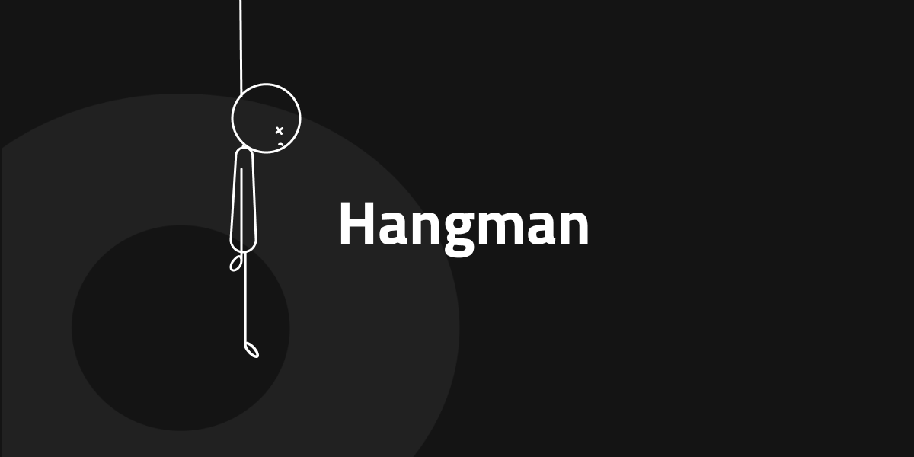
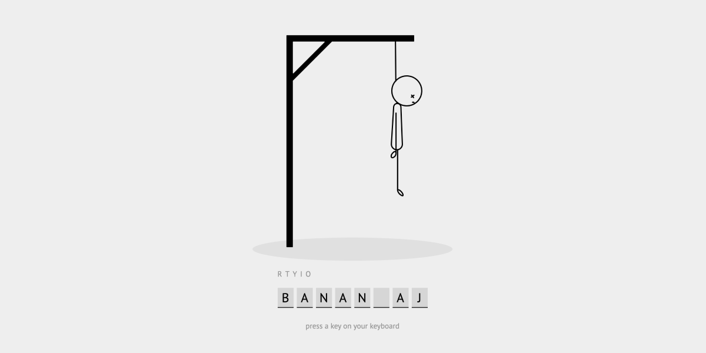

# Hangman

Classic game of Hangman with HTML, CSS and JS

## Instructions

You are going to build your version of the classical game Hangman. 

To your help, you have the `hangman.svg` that you can use in order to add the parts of the 'hangman'. It makes it possible to add a part of the `hangman` whenever you type in a letter that is not part of the secret word.

It works by changing the opacity of the `<ellipse>` element and the different `<path>` elements within the `<svg>`. If the opacity is 0, that part of the `<svg>` won't be visible. If it is 1 it will. The `<svg>` has enough parts _( ellipse and path elements )_ for six tries to guess the secret word.

### Restrictions

- It must be built with vanilla JavaScript.
- No usage of CSS frameworks or SCSS.

### Requirements

- The secret word must be displayed in a way that makes it clear on how many letters that exist in the secret word.

- The previously typed letter must be visible for the user and if the player happens to type an already used letter, it should not affect the game, i.e. it should not count.

- If the player fails guessing the secret word, the UI should show that in a proper way and give the player the opportunity to start again, _( with a new secret word of course )_

- Same should happen if the player wins.

- The secret word should be selected by random when the game starts, from an array of existing words.

_( The screenshot below is just a suggestion on how it can look when the user failed to guess to secret word )_

